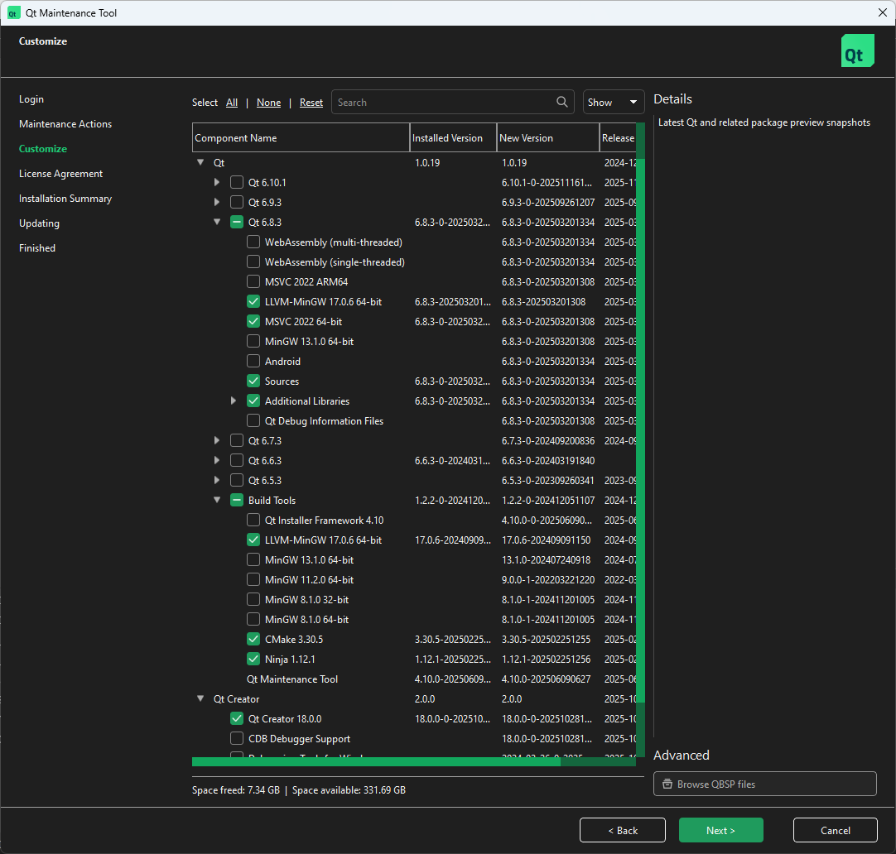

# Develpment

## Prerequisites

The development is done on Ubuntu 22.04 and Windows 10.
The application will probably work on other platforms, but only those targets are supported.

- [Git](https://git-scm.com/)
- [Python](https://www.python.org/)
- A C++ 17 compiler for the platform
    - GCC for Linux
    - LLVM-MinGW recommended for Windows
        - Alternatively MSVC (installed with Visual Studio)
- [Qt for Open Source Development](https://www.qt.io/download-open-source)
    - Qt version **6.8**
        - Choose the version for your compiler
        - All Additional Libraries
    - Qt Creator
    - *Windows LLVM-MinGW* can be installed from Build Tools section
    - *Ubuntu only*: Manually install XCB library: `sudo apt install libxcb-cursor0`
- *Optional, but recommended*: Qt installs its own CMake, but you may need to install `cmake-format` manually, with `pip install cmakelang` or `apt install cmake-format`



To conserve disk space you can select libraries actually used in the project, see [the project's CMakeLists.txt](https://github.com/marsh-sim/marsh-manager/blob/main/CMakeLists.txt), but it's possible in the future more will be used.

## Downloading the source code

To use our own dialect, the project depends on [a fork of MAVLink](https://github.com/marsh-sim/mavlink), included as a [Git Submodule](https://git-scm.com/book/en/v2/Git-Tools-Submodules) (which in turn has [pymavlink](https://github.com/ArduPilot/pymavlink) inside).

Open the folder where you want to keep the project code, and open it in terminal.
To clone [the repository](https://github.com/marsh-sim/marsh-manager) with its inner modules, add the `--recursive` flag:

```bash
git clone https://github.com/marsh-sim/marsh-manager.git --recursive
cd marsh-manager
```

!!! note
    If you didn't get the submodules during clone, or they changed to a different commit, you can update them with: `git submodule update --init --recursive`

## Building the project

### MAVLink library

After downloading the project for the first time, or after changes in the MAVLink dialect, the communication library needs to be regenerated.
A virtual environment is recommended to avoid mixing packages installed here with system packages.
The following commands can be used for Linux:

```bash
python3 -m venv venv
source venv/bin/activate
pip install -r requirements.txt
```

For users on Windows, only the line to activate the virtual environment changes to:

```ps1
./venv/Scripts/activate
```

With the environment activated and all prerequisites installed, run the generator script:

```bash
python scripts/update_mavlink.py
```

### Qt application

Launch Qt Creator, click "Open Project..." on the left and open the `CMakeLists.txt` file in  the`marsh-manager` directory.

When shown the Configure window, choose your selected compiler kit and click "Configure Project" in the bottom right corner.

The project can be compiled and optionally built using the buttons in the bottom left corner, or the "Build" menu on the top menu bar.
This should rebuild all the necessary files, and optionally start the application and attach a debugger.

!!! note
    The details of application version are generated by CMake based on last Git commit.
    You should fully run CMake after every commit. If you didn't change anything, run manually with: "Build"&nbsp;>&nbsp;"Run&nbsp;CMake"


The application can be built in different modes, [a short explanation quoted from Stack Overflow](https://stackoverflow.com/questions/8829946/whats-the-difference-between-a-qt-debug-version-and-the-qt-release-version):

> Debug versions are usually slower, larger, and take up more RAM. They have debugging symbols, which make debugging possible and simpler. Release versions are stripped of all non-production information.
>
> In debug builds variables and memory are generally set to zero but in release this step is skipped to save time. Extra data is also added around objects and allocated memory as barriers to detect memory overwrites.

In this specific project, building is noticeably faster for Debug builds.
You can differentiate Debug build from Release by the window title, in which Debug builds also have the commit count on the end of version string after a `+` sign.


## Optional: Qt Creator configuration

Qt Creator **includes Vim mode** ("Edit" > "Preferences" > "FakeVim").

### Formatting

To avoid "noisy diff" where changes are just formatting changes, it's recommended to enable format on save for all used kinds of source files:

- In window "Edit" > "Preferences":
    - "C++" > "Code Style"
    - "Qt Quick" > "QML/JS Editing"
    - "CMake" > "Formatter"


