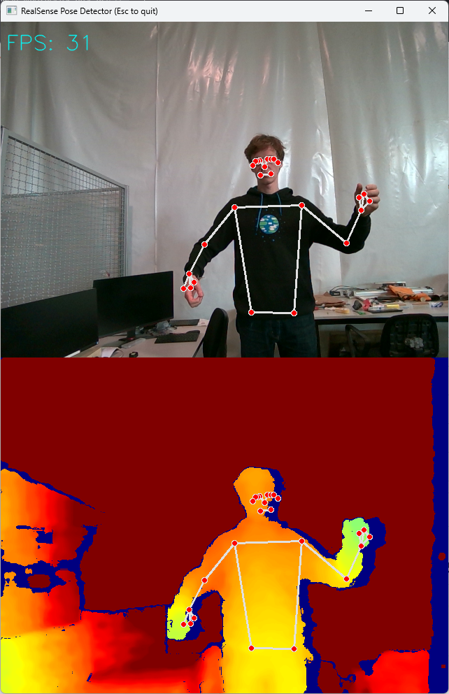

# Body pose tracking

A simple adapter in Python is developed in [MARSH-Sim public repository](https://github.com/marsh-sim/realsense-pose-detector) based on [RealSense Pose Detector](https://github.com/cansik/realsense-pose-detector) which was fairly easy to run and works, tested with Intel RealSense D455F.

The application sends the [HUMAN_BODY_POSE](../mavlink/marsh.md#HUMAN_BODY_POSE) message.
Currently the 3D system of coordinates is from **camera's point of view**:

- X: forward
- Y: right
- Z: down

The coloring scale goes between 0 or missing data - deep blue and 2 meters or more - deep red.
The camera can measure greater distances, but this makes the view of cockpit more legible.



## Installation

Note that the RealSense cameras require a USB-C cable **with USB 3 connections**.

The project is managed with [uv](https://docs.astral.sh/uv/getting-started/installation/).
This command should take care of dependencies and start the program:

```sh
uv run pose.py
```

### Windows

[Intel RealSense SDK](https://github.com/IntelRealSense/librealsense), get the latest stable release from the Releases section on the right.

## Tracked points

Currently we're using [Google's MediaPipe Pose Landmarker](https://ai.google.dev/edge/mediapipe/solutions/vision/pose_landmarker).
The landmark model predicts the location of 33 full-body landmarks (see figure below), each with (`x, y, z, visibility`).
The current model does not use depth data directly, we're projecting the positions identified on 2D image into 3D space using RealSense afterwards.
This means that the position of points is centered on the joint in 2D, but on the closest surface to camera in depth.

Messages are sent only for points that have visibility higher than the minimum threshold.
The definitions [HUMAN_BODY_POINT](../mavlink/marsh.md#HUMAN_BODY_POINT) start with the same indices as this model's output:


## Alternate models

For skeletal pose estimation Intel recommends ([1](https://github.com/IntelRealSense/librealsense/issues/6580#issuecomment-643726272))([2](https://www.intel.com/content/www/us/en/support/articles/000089525/programs/e-commerce-stores.html)):

- FOSS [RealTime3DPoseTracker-OpenPose](https://github.com/bagridag/RealTime3DPoseTracker-OpenPose) with 23 step installation process
- 333$ perpetual license [LIPSense 3D Body Pose SDK](https://www.lips-hci.com/3d-body-pose-sdk)
- subscription to NUITRACK SDK
