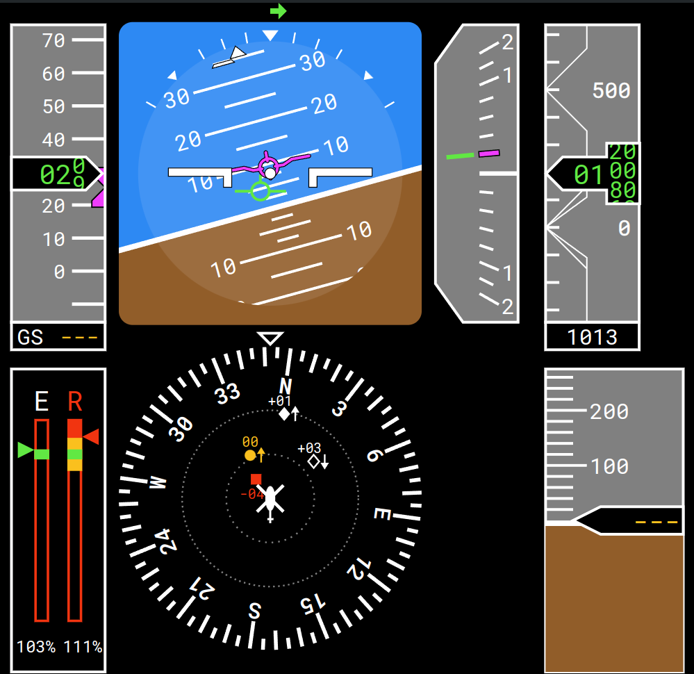

# Instruments

Python package [`lidia`](https://pypi.org/project/lidia/) can be used with MARSH starting with version 0.10 to provide instrument visualisation.
The output is rendered in a web browser, so it can be accessed from other computers, or embedded in visualisation software

## Installation

The package can be installed using any of these commands:

```sh
uv tool install lidia
pipx install lidia
pip install lidia  # preferably inside a virtual environment (venv)
```

## Usage

The package has multiple sources of data to choose from, in this case start it like this:

```sh
lidia marsh
```

### Primary Flight Display

By default displayed at [localhost:5555/pfd](http://localhost:5555/pfd).
Magenta markers indicate target value.



### Controls position

By default displayed at [localhost:5555/controls](http://localhost:5555/controls).
Central square shows cyclic control, left bar collective position, and lower bar, pedal position.
Red/yellow/green arrows and circle indicate current position, blue arrows and dashed lines trim.
Magenta stars are desired positions with dotted lines for desirable and adequate margins.


