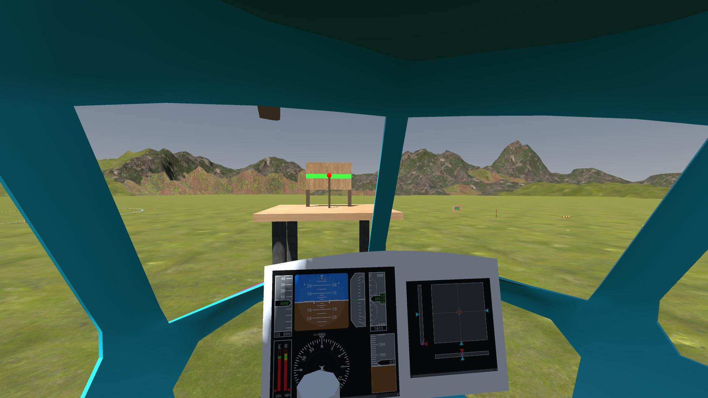

# Visualisation

Developed using [Godot Engine](https://godotengine.org/) and configured to display cockpit [instruments](./instruments.md) with [lidia](https://pypi.org/project/lidia) Python package.

The environment features all obstacles suggested by ADS-33, but the vertical repositioning is modified to provide a reference similar to hover board at 15 and 40 feet above ground.


## Installation

Download the release from [Releases page of this documentation](https://github.com/marsh-sim/marsh-sim.github.io/releases)

Alternatively see [development section below](#development) for instructions how to run the project using Godot Editor.

## Usage

The application will attempt to start in VR, but if it fails it will display the default pilot viewpoint looking forward.



### Controls

- Use the mouse to look around when not using VR
- Move the viewpoint with `W` forward, `S` backward, `A` left, `D` right, `E` up, and `C` down
    - Reset this position to initial with `Q`
    - Does not work when physically tracking the cockpit position (eg. Vive Tracker on motion platform)
- Exit with `Alt+F4`

### Parameters

These can be modified over MAVLink, for example using MARSH Manager.

Example changes to `NAV_OFS_` parameters to start in given positions:

- Sidestep, vertical repositioning: all default
- Accelerate/decelerate: `HDG` = -90
- Hover maneuver: `X` = 50, `Y` = 50
- Start of slalom: `HDG` = -90, `X` = -100, `Y` = 300

#### NAV_OFS_HDG

Displayed heading relative to default position, in degrees.

#### NAV_OFS_X

Starting position offset, forward in default orientation, in meters.

#### NAV_OFS_X

Starting position offset, right in default orientation, in meters.

#### LOCAL_FRAME_LAT

Latitude of local coordinate frame origin when using messages with global position, in degrees.

#### LOCAL_FRAME_LON

Longitude of local coordinate frame origin when using messages with global position, in degrees.

## Roadmap

- Try to have some acceptable setup for Varjo even without the tracker
- Rework the fly area
    - Make it bigger
    - Keep it square to avoid assymetric geometry
    - Don't use the flat plane, just flatten the terrain
    - Make the terrain mostly green, but add some small patches of different color
- Fix z-figthing when looking at the runway from afar
- Reduce pixel artifacts
    - Adjust antialiasing
    - Ensure there are mipmaps and they're used

## Development

The source code is hosted using internal Git service of Politecnico di Milano at [DAER/FRAME-Sim/MARSH/visualisation-marsh](https://gitlab.polimi.it/DAER/frame-sim/marsh/visualisation-marsh).
There is a public mirror using [Forgejo](https://forgejo.org/) at `git(dot)lukasiewicz(dot)tech/DAER/visualisation-marsh` *not a link to avoid automated crawlers*.

The asset files like textures and models are very big, so the project also uses [Git Large File Storage](https://git-lfs.com/).
Once installed, it should work correctly with usual `git` commands but you may need to run this if you install it after cloning the repository:

```sh
git lfs pull
```

This repository uses [Git Submodules](https://git-scm.com/book/en/v2/Git-Tools-Submodules), to get all the code you need to run either:

```sh
git clone --recurse-submodules <address of this repository>
# Or at any later point
git submodule update --init --recursive
```

Using Godot v4.4.
Install SCons with `pipx install scons`.
You will need a C++ compiler, you might have one already on Linux, see below for Windows, otherwise in [Godot documentation](https://docs.godotengine.org/en/stable/contributing/development/compiling/index.html).

For updating MAVLink generator, you additionally need `pip install future`.
It is recommended to install any packages in a [virtual environment](https://docs.python.org/3/library/venv.html), for example:

```sh
python3 -m venv venv
source venv/bin/activate
pip install future
```

Some files are generated, run the following commands on first setup and when dependencies change:

```sh
godot --dump-extension-api  # after updating Godot
python update_mavlink.py    # after updating MAVLink dialect
python update_addons.py     # after changing any addon submodules
scons compile_commands      # after modifying SConstruct
cd project/addons/gdcef; python build.py
```

### Windows setup

The most convenient way of getting a C++ compiler is via the LLVM-MinGW project (by the way, it optimizes the binary more).
Download the `llvm-mingw-...-msvcrt-x86_64.zip` from the [Releases page](https://github.com/mstorsjo/llvm-mingw/releases).
Unzip the archive to some location you like, and add its `bin` folder to `Path` using the "Edit environment variables for your account" program.

### Build

To build the GDExtension binary run SCons in the repository root, the default arguments have been added to the file.

```sh
scons
```

When building for Windows with MinGW-LLVM, you need to [select this compiler](https://docs.godotengine.org/en/stable/contributing/development/compiling/compiling_for_windows.html#selecting-a-compiler):

```powershell
scons platform=windows use_mingw=yes use_llvm=yes
```

## Deprecated UE5

This visualisation is made in Unreal Engine 5. The scenery features all recommended ground references from the ADS-33E standard, and the visual helicopter model is the [Eurocopter MH-65 Dolphin](https://en.wikipedia.org/wiki/Eurocopter_MH-65_Dolphin). The instruments shown inside the cockpit are rendered by `lidia` package described above, so it must be running locally with the standard port to display them.

Controls:
- Use the mouse to look around
- Move the viewpoint with `W` forward, `S` backward, `E` up, and `C` down
- Cycle the fog intensity with `F`
- Exit with `Alt+F4` 😈

To start the simulation in different locations of the scenery or different headings, edit the parameters using MARSH Manager window. You can also remotely change the fog intensity this way.

If VR hardware is connected, the visualisation will start in the VR mode, otherwise it will run same as a regular fullscreen game.


Unfortunately, source code for Unreal Engine projects is quite incompatible with Git, so the Subversion repository was hosted privately.

### Reasons for deprecation

- Very lengthy installation process, and difficult with the network configuration at the laboratory
- Little to no support for editing projects on Linux
- Licensing of used assets forbids distribution in editable form.
- Had unresolved performance problems when using VR headset with platform tracker
- Had visual artifacts when using with Varjo headset, that we didn't manage to resolve. While Godot is less visually appealing at the start, it's a much simpler system.
